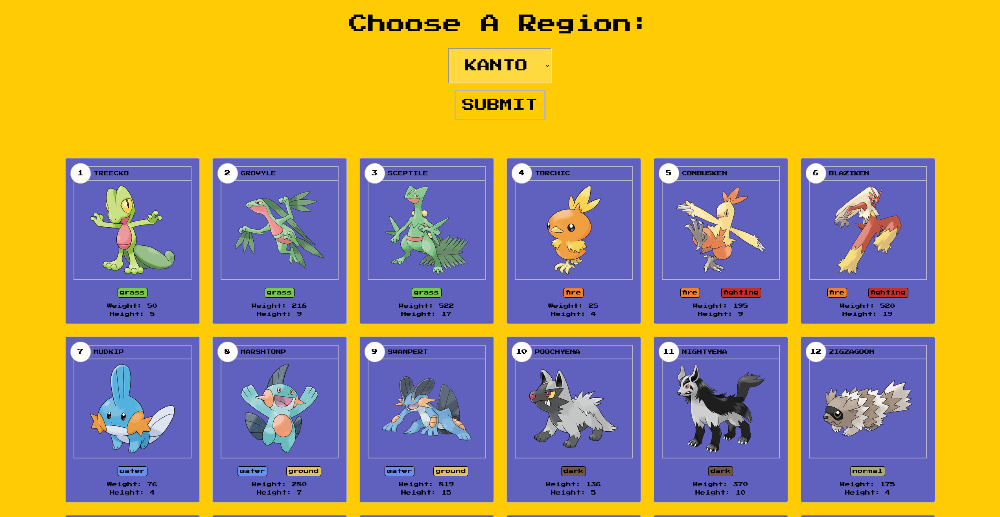

# Pokedex List

## _w. PokéAPI_

Made a pokedex viewer using the public API PokéAPI,
using JS, HTML, CSS, EJS, NODEJS, EXPRESS and AXIOS.

- Choose a Pokemon Region from the dropdown
- Submit your choice
- Wait a few seconds and... ✨You got them all!✨

## Installation

- Download the project and open it with your source code editor
- on your terminal, use `npm i` to install all the packages needed
- then use `nodemon index.js` to run the project
- open http://localhost:3000/ and choose your region!
